# Campus Connect

A Flutter project to help students to connect with teachers and vice versa.

## Milestone-1

    - UI design
    - Widgets:
        - Bar
        - colors
        - CourseSessionScreen
        - Details
        - main
        - Semester
        - Course
        - Dashboard
        - Home
        - Information
        - Profile

## Team Members

```mermaid

graph TD
    subgraph Group 1 [Details]
        A1["Roll 1: Eusuf Abdullah"] --> A2["Roll 5: Shahidul Islam"]
        A2 --> A3["Roll 30: Shahadat Hossain Roky"]
    end

    subgraph Group 2 [Details]
        B1["Roll 12: GOURAB SARKAR"] --> B2["Roll 19: Sourav Kumar Shaha"]
        B2 --> B3["Roll 29: A A Sakib"]
    end

    subgraph Group 3 ["Main + Writing Documentation"]
        C1["Roll 3: Suraiya Jabin Ekra"] --> C2["Roll 4: Sumaia Rahman"]
        C2 --> C3["Roll 25: Afrina Tabassum"]
    end

    subgraph Group 4 [Semester]
        D1["Roll 7: Antar Sarker"] --> D2["Roll 8: Sadia Tabassum"]
        D2 --> D3["Roll 14: Farhan Masud"]
    end

    subgraph Group 5 ["Course + CourseScreen"]
        E1["Roll 9: Nayan-E-Alam Procchod"] --> E2["Roll 10: Zarin Sharmin"]
        E2 --> E3["Roll 11: Mahbuba Jebin"]
    end

    subgraph Group 6 ["Dashboard + Profile"]
        F1["Roll 31: Md. Khalid Hasan Milton"] --> F2["Roll 34: Sakib Nihal Arnab"]
        F2 --> F3["Roll 36: Md. Talha Bin Zaid"]
    end

    subgraph Group 7 [Information]
        G1["Roll 16: Taznim Juwana Islam"] --> G2["Roll 18: Nazmunnahar"]
        G2 --> G3["Roll 37: Jannatul Ferdous Arthy"]
    end

    subgraph Group 8 [Bar]
        H1["Roll 20: MD. Minhazur Hossain"] --> H2["Roll 13: Md. Ashikur Rahman"]
        H2 --> H3["Roll 41: Md. Niamul Haque Shreezon"]
    end

    subgraph Group 9 [Semester]
        I1["Roll 24: Tarana Islam"] --> I2["Roll 33: Munira Huda"]
        I2 --> I3["Roll 38: Iffat Farzana"]
    end

    subgraph Group 10 [Home]
        J1["Roll 2: Aranna Shrabon"] --> J2["Roll 27: Md. Kamruzzaman"]
        J2 --> J3["Roll 32: Tandra Karmakar"]
    end

```

| Group     | Responsibility                 | Members                                                    |
|-----------|--------------------------------|------------------------------------------------------------|
| Group 1   | Details                        | Roll 1: Eusuf Abdullah, Roll 5: Shahidul Islam, Roll 30: Shahadat Hossain Roky |
| Group 2   | Details                        | Roll 12: GOURAB SARKAR, Roll 19: Sourav Kumar Shaha, Roll 29: A A Sakib |
| Group 3   | Main + Writing Documentation   | Roll 3: Suraiya Jabin Ekra, Roll 4: Sumaia Rahman, Roll 25: Afrina Tabassum |
| Group 4   | Semester                       | Roll 7: Antar Sarker, Roll 8: Sadia Tabassum, Roll 14: Farhan Masud |
| Group 5   | Course + CourseScreen          | Roll 9: Nayan-E-Alam Procchod, Roll 10: Zarin Sharmin, Roll 11: Mahbuba Jebin |
| Group 6   | Dashboard + Profile            | Roll 31: Md. Khalid Hasan Milton, Roll 34: Sakib Nihal Arnab, Roll 36: Md. Talha Bin Zaid |
| Group 7   | Information                    | Roll 16: Taznim Juwana Islam, Roll 18: Nazmunnahar, Roll 37: Jannatul Ferdous Arthy |
| Group 8   | Bar                            | Roll 20: MD. Minhazur Hossain, Roll 13: Md. Ashikur Rahman, Roll 41: Md. Niamul Haque Shreezon |
| Group 9   | Semester                       | Roll 24: Tarana Islam, Roll 33: Munira Huda, Roll 38: Iffat Farzana |
| Group 10  | Home                           | Roll 2: Aranna Shrabon, Roll 27: Md. Kamruzzaman, Roll 32: Tandra Karmakar |

This table summarizes the group assignments along with each group’s focus and its members.
